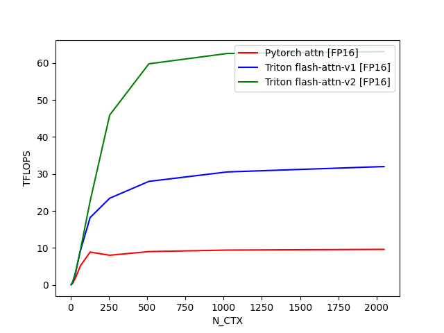

## Quick Start

### Build Extension

```bash
python setup.py build_ext --inplace
```

### Run Flash Attention Benchmark

```bash
uv run -m benchmark.flash_attn
```

The benchmark results will be saved to `./benchmark/` directory, including:

#### Flash Attention Benchmark Results

**Benchmark Configuration:**
- Batch size (B): 4
- Number of heads (H): 32
- Head dimension (D): 64
- Causal: False

**Performance Results (TFLOPS):**



*Benchmark tested on A10 GPU*

## Compile CUTE Kernel

CUTLASS version: v4.2.1

```bash
mkdir build && cd build
cmake ..
make
```

## Debug Triton Kernel

```bash
.venv/bin/activate
TRITON_INTERPRET=1 python -m pdb csrc/triton/matmul.py
```
